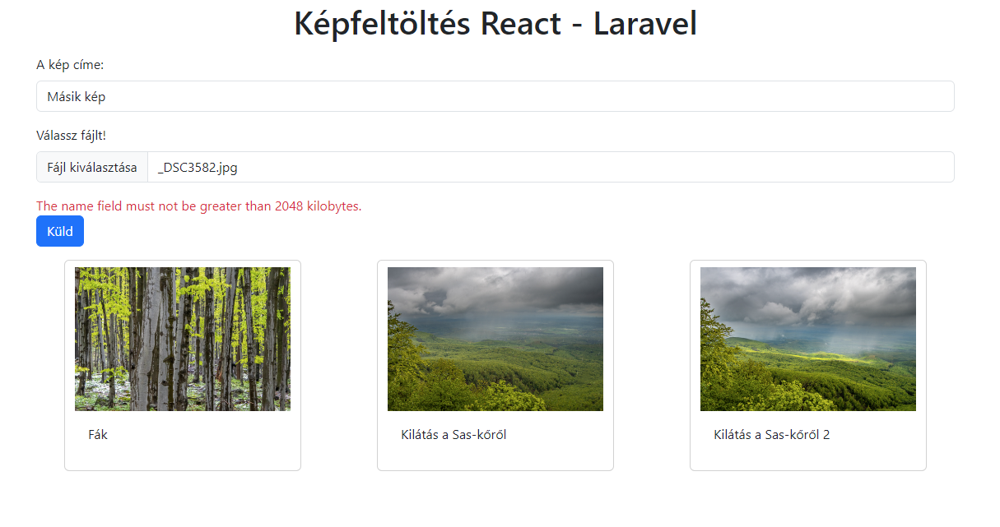

# Kép feltöltése

<a href="https://github.com/csefikatalin/backend_kepfeltoltes.git" target="_blank">Laravel backend repo</a>  
<a href="https://github.com/csefikatalin/frontend_kepfeltoltes.git" target="_blank">React frontend repo</a>

# Frontend React 18.3.1

## React telepítése bootstrap-pel és axios-szal: 

    npx create-react-app frontend_kepfeltoltes
    npm install react-bootstrap bootstrap
    npm install axios

### Importáljuk a bootstrap fájlt az index.js-be

    import "bootstrap/dist/css/bootstrap.min.css";

### Hozzuk létre a saját axios configurációs fájlunkat

    import axios from "axios";

    export default axios.create({
        baseURL:"http://localhost:8000/api",
        withCredentials:true,
        withXSRFToken :true, 
        
    })
## FileContext.js

1. létrehozzuk a context és provider objektumokat
2. Beállítjuka  state-ket
3. Elkészítjük a GET és a POST axios kéréseket
4. **Nagyon fontos**, hogy a POST **header**jében adjuk meg, hogy nem az alapértelmezett JSON formátumot fogjuk küldeni, hanem fájlokat, tehát **multipart/form-data-t**!

   headers: {
                "Content-Type": "multipart/form-data",
            },

A teljes kód:

    import axios from "../MyAxios";
    import { createContext, useContext, useEffect, useState } from "react";

    const FileContext = createContext(); // context létrehozása
    export const FileProvider = ({ children }) => { //Provider

    const [kepekLista, setKepekLista] = useState([]);// a state változók elkészítése

    //Az adatok lekérdezése a végpontról
    const getLista = async (vegpont, callBack) => {
        const { data } = await axios.get(vegpont);
        callBack(data);
    };

    // adatok küldése 
    
    const postAdat = async ({ ...adat }, vegpont) => {   
        try {
        await axios
            .post(vegpont, adat, {
            headers: {
                "Content-Type": "multipart/form-data",
            },
            })
            .then((resp) => {
            console.log(resp);
            setKepekLista(resp.data);
            });
        } catch (error) {
        console.log(error);
        }
    };

    useEffect(() => {
        getLista("/file-upload", setKepekLista);
    }, []);

    return (
        <FileContext.Provider value={{ kepekLista, postAdat }}>
        {children}
        </FileContext.Provider>
    );
    };

    export default function useFileContext() {
    return useContext(FileContext);
    }

### Az index.js-ben fogjuk körbe a providerrel az App komponenst. 

    root.render(
    <React.StrictMode>
        <FileProvider>
        <App />
        </FileProvider>
    </React.StrictMode>
    );

## Komponensek létrehozása a component mappában

### 1. Card.js - Card komponens

Ez a komponens jelenít meg egyetlen képet: 

    export default function Card(props) {
        //console.log(props.kep)
        return (            
            

            
            
{props.kep.title}

            
            
        )
    }

### 2. Megjelenit.js - Megjelenit komponens

Használjuk a FileContext-ben definiált kepekLista-t. Be kell importálnunk a useFileContext() függvényt. 

    import useFileContext from "../contexts/FileContext";
    import Card from "./Card";

    export default function Megjelenit() {
    const { kepekLista } = useFileContext(); // itt tesszük elérhetővé  a context-ben megadott változót. 
    //console.log(kepekLista);
    return (
        

        

            {kepekLista.map((kep, index) => {
            return <Card kep={kep} key={index} />;
            })}
        

        

    );
    }

### 3. FormComponent.js
 
1. Megadjuk a form elemek state változóit. 
2. Összeállítjuk az űrlapot.
3. Az input elemek onChange eseményénél változtatjuk a state-k értékét. A fájl esetében ez így néz ki:  

    onChange={(event) => {
            setFile(event.target.files[0]);
    }}

4. A Form submit eseményére összeállítjuk az adatokat.  és meghívjuk a contex-ben definiált post függvényt. Ehhez itt is importáljuk a useFileContext() függvényt. 

  const { postAdat } = useFileContext();

  function kuld(event) {
    event.preventDefault()
     let adat = {
      title: title,
      name: file,
    };
    console.log(adat) 
   
    postAdat(adat,"/file-upload")
  }

A teljes kód: 

    import React, { useState } from "react";

    import useFileContext from "../contexts/FileContext";

    export default function FormComponet() {
    const { postAdat } = useFileContext();
    const [file, setFile] = useState(null);
    const [title, setTitle] = useState("");

    function kuld(event) {
        event.preventDefault()
        let adat = {
        title: title,
        name: file,
        };
        console.log(adat) 
    
        postAdat(adat,"/file-upload")
    }

    return (
        

        <form onSubmit={kuld}>
            

            <label htmlFor="title" className="form-label">
            A kép címe:
            </label>
            <input
                type="text"
                className="form-control"
                id="title"
                onChange={(event) => {
                setTitle(event.target.value);
                }}
                placeholder="kép címe"
            />
            

            

            <label htmlFor="name" className="form-label">
                Válassz fájlt!
            </label>
            <input
                type="file"
                accept="image/png, image/jpeg" 
                className="form-control"
                onChange={(event) => {
                setFile(event.target.files[0]);
                }}
                id="fileNev"
                placeholder="Válasszon fájlt..."
            />
            

            <input
            type="submit"
            className="btn btn-primary"
            id="submit"
            value="Küld"
            />
        </form>
        

    );
    }

## Hibakezelés

1. FileContext.js - ben az error state létrehozása

    const [errors, setErrors] = useState({  });

2. A POST kérés hibakezelésénél beállítjuk az errors változó értékét. 

    } catch (error) {
        console.log(error);
        if (error.response.status === 422) {
            setErrors(error.response.data.errors);
        }
    }

3. Ne felejtsük el az errors változót is felsorolni a FileContext.Provider value értékei között. 

    return (
        <FileContext.Provider value={{ kepekLista, postAdat, errors }}>
        {children}
        </FileContext.Provider>
    );

4. A FormComponentbe importáljuk be az errors változót is.

   const { postAdat, errors } = useFileContext();

5. Minden imput elem mögé helyezzünk el egy div-et, amiben visszajelzzük a kapott hibát: 

        

          {errors.title && (
            {errors.title[0]}
          )}
        

